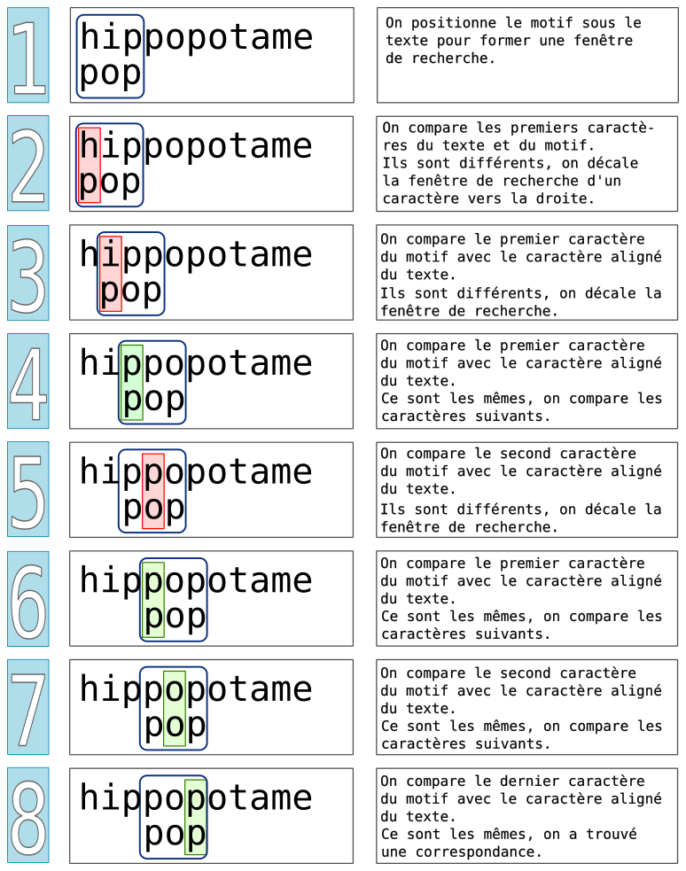

Algorithme de Boyer et Moore
============================

La recherche textuelle consiste à trouver la présence d'une chaine de caractères appelée **motif** dans un texte. Il existe différents algorithmes qui résolvent ce problème.

Le langage Python propose la méthode ``find`` qui s'applique sur les chaines de caractères. Si on crée une variable ``texte`` de type ``str``, on peut lui appliquer la méthode ``find`` qui prend en paramètre une chaine de caractères et qui renvoie l'indice du premier caractère dans le texte qui correspond au motif.

    >>> texte = 'La moto de Tom'
    >>> texte.find('mot')
    3

.. note::

    Vous pouvez chercher les exercices 1 et 2.

Recherche naïve
----------------

L'algorithme naïf consiste à comparer un à un, de gauche à droite, les caractères du texte avec ceux du motif. Deux cas sont à envisager:

-   Le caractère du texte et le caractère du motif correspondent, on passe au caractère suivant du motif et on le compare au caractère suivant du texte.
-   Le caractère du texte et du motif ne correspondent pas, on décale le motif d'un caractère vers la droite.

On recommence les comparaisons jusqu'à la fin du texte ou du motif tant qu'il ny a pas de correspondance. L'algorithme se termine si on trouve une correspondance ou si on arrive à la fin du texte sans correspondance.

Prenons l'exemple du texte ``hippoppotame`` et du motif ``pop`` en plaçant le motif juste en dessous du texte.

En appliquant l'algorithme, on obtient les différentes étapes suivantes à chaque itération.

.. note::

    Vous pouvez chercher les exercices 3 et 4.

Algorithme de Boyer-Moore
--------------------------

L'algorithme présenté est une version simplifiée de l'algorithme de Boyer et Moore inventée par Nigel Horspool.

L'algorithme repose sur 2 idées principales:

-   On compare le motif avec le texte en se commençant par la fin du motif, c'est à dire de droite à gauche et non de gauche à droite comme pour l'algorithme naïf. 
-   Lorsqu'il n'y a pas de correspondance entre le caractère du motif et le caractère aligné du texte, deux cas se présentent:

    **cas 1**:  le caractère du texte n'est pas dans le motif, alors on décale le motif de toute sa longueur;

    **cas 2**:  le caractère du texte est présent dans le motif, alors on décale le motif de 1 caractère à droite.

En pratiquant ainsi, on peut éviter de nombreuses comparaisons. Voyons comment se déroule l'algorithme à travers un exemple.

.. figure:: ../img/recherche_horspool_2.png
    :align: center
    :width: 600